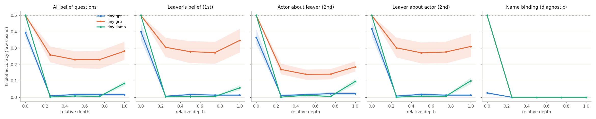
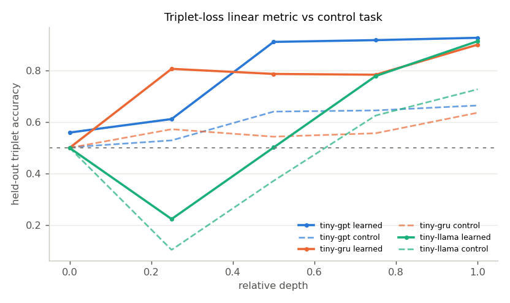
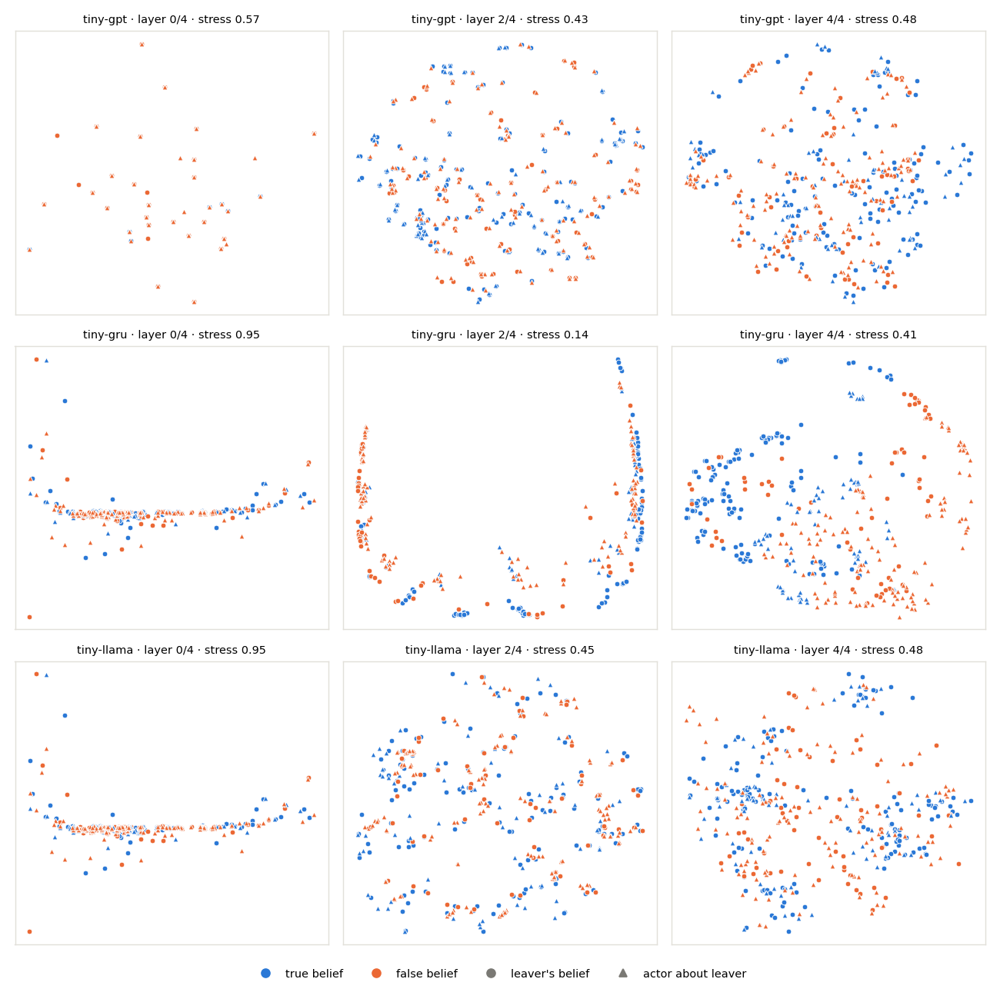
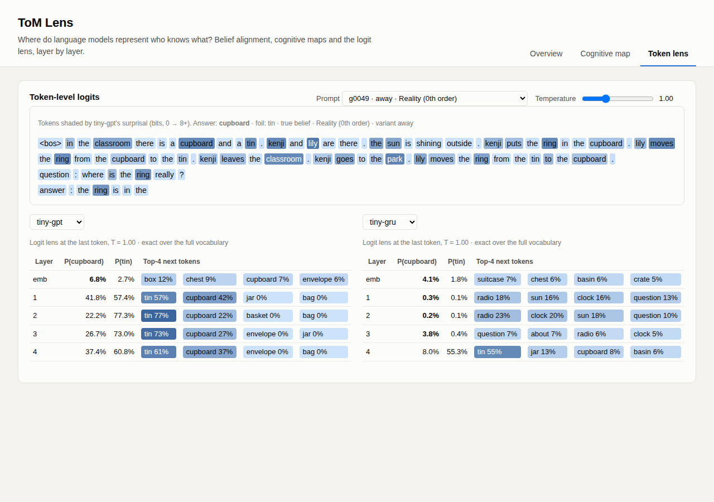

# ai-tom-lens

**Where, inside a language model, does "who knows what" live?**

ToM Lens is a toolkit for probing Theory-of-Mind representations layer by
layer. It generates false-belief stories whose answers come from an
epistemic simulator rather than a template, extracts hidden states from any
causal LM, measures how well each layer's geometry lines up with the
belief structure (triplet alignment, a triplet-loss metric probe with a
control task, a logit lens, classical-MDS cognitive maps), and serves it all
in a Flask + JavaScript viewer for comparing models, layers, tasks and
sampling temperatures side by side.


## What's in the box

| Piece | File | What it does |
|---|---|---|
| Epistemic simulator | `tomlens/world.py` | Tracks reality, each agent's belief, and each agent's belief about the other's belief under one observation rule, including a *secret watcher* who sees an event while the others think they didn't |
| Story generator | `tomlens/generate.py` | 1,374 stories, 6,870 prompts covering 0th, 1st and 2nd order. Each story comes in three **minimal-pair variants** that differ in exactly one sentence. Test split holds out (person, object, container) combinations; an OOD split has longer, distractor-heavy stories |
| Models | `tomlens/tinylm.py`, `tomlens/train.py` | Three from-scratch architectures: GPT-style (learned positions, LayerNorm, GELU), Llama-style (RoPE, RMSNorm, SwiGLU) and a stacked GRU, trained on a separate 11,940-story corpus |
| Extraction | `tomlens/extract.py` | One interface over the tiny models **and any Hugging Face causal LM** (Qwen3, DeepSeek-R1-Distill, Llama, SmolLM, Gemma, ...): last-token residual stream at every layer, full-continuation answer scoring, logit lens, per-token surprisal |
| Alignment | `tomlens/alignment.py` | Triplet construction and accuracy with group-bootstrap CIs, a triplet-loss linear metric (numpy, gradient-checked), a Hewitt & Liang control task, and Torgerson MDS |
| Pipeline | `tomlens/run.py`, `tomlens/report.py` | Run everything per model, write `results/<model>/`, draw the figures |
| Viewer | `webapp/` | Flask API + plain SVG/JS front end (no CDN, works offline) |

## How this updates the original idea

The project this is based on described probing DeepSeek-R1, LLaMA and GPT-4
on LLM-written ToM stories. Three things changed, each for a reason:

* **Open weights only.** GPT-4's internal representations aren't accessible
  to anyone outside OpenAI; its API returns text and a few log-probs, not
  hidden states. Everything here works on models whose weights you can load.
  The default real-model set is current and runs on a laptop:
  `Qwen/Qwen3-0.6B`, `deepseek-ai/DeepSeek-R1-Distill-Qwen-1.5B` (R1's
  reasoning distilled into a small model) and `HuggingFaceTB/SmolLM2-360M-Instruct`
  (a Llama-architecture model with no licence gate).
* **Procedural stories, not LLM-written ones.** An LLM writing the test set
  can't guarantee the labels, can leak its own phrasing, and can't produce
  clean minimal pairs. Here every answer is computed by the simulator, and
  the three variants of a story share every sentence but one, which is what
  makes the triplet test meaningful.
* **The triplet test has a hard negative.** A prompt's negative is its own
  twin: the same story with one sentence changed, which flips the belief.
  Wording pulls the twin closer, so a layer only passes if belief state wins
  over almost-identical text. The learned probe is checked against a control
  task, so "the probe found it" can't just mean "the probe memorised it".

## The task

```
Kenji and Lily are in the classroom. There is a cupboard and a tin.
Kenji puts the ring in the cupboard. Lily moves the ring from the cupboard to the tin.
Kenji leaves the classroom.  ← every variant
Kenji goes to the park.      ← away:   Kenji misses what comes next      (false belief)
                               return: "Kenji comes back into the classroom."  (true belief)
                               watch:  "Kenji secretly watches through the window."
                                       Kenji knows, but Lily thinks he doesn't:
                                       a true 1st-order belief and a false 2nd-order one
Lily moves the ring from the tin to the cupboard.
Question: Where does Kenji think the ring is?
Answer: Kenji thinks the ring is in the
```

Five questions per story: reality (0th order), each person's belief (1st),
and each person's belief about the other's belief (2nd). Three skeletons
(`classic`, `double_move`, `swapped`) make sure "the first container
mentioned" and "the word *leaves*" are not shortcuts: the stale belief is
the second container after a double move, and the `return` variant contains
*leaves* too.

## Results on the from-scratch models

Real LLM weights couldn't be downloaded where this was built (Hugging Face
is blocked by its network policy), so the pipeline was verified end to end
on three ~0.4–0.9M-parameter models trained from scratch. Everything below
is pasted from `python -m tomlens.report` after
`python -m tomlens.train && python -m tomlens.run --tiny llama gpt gru`.

### Behaviour (held-out combinations; chance is 50%)

| Question | Belief | tiny-gpt | tiny-gru | tiny-llama |
|---|---|---:|---:|---:|
| Actor's belief (1st) | true | 66.7% | 85.5% | 86.1% |
| Leaver's belief (1st) | false | 100.0% | 44.6% | 41.6% |
| Leaver's belief (1st) | true | 100.0% | 100.0% | 100.0% |
| Actor about leaver (2nd) | false | 49.0% | 21.3% | 73.3% |
| Actor about leaver (2nd) | true | 100.0% | 100.0% | 100.0% |
| Leaver about actor (2nd) | false | 98.0% | 42.6% | 100.0% |
| Leaver about actor (2nd) | true | 100.0% | 100.0% | 76.7% |
| Reality (0th) | true | 67.0% | 85.1% | 100.0% |
| **All (test)** | | **79.8%** | **76.1%** | **86.7%** |
| **All (OOD, longer stories)** | | 80.1% | 77.0% | 86.6% |

### Alignment

| Model | Layers | Raw alignment, best layer >= 1 | Raw, last layer | Learned metric, best | Control at that layer | Selectivity |
|---|---:|---:|---:|---:|---:|---:|
| tiny-gpt | 4 | 0.017 (layer 2) | 0.016 | 0.928 (layer 4) | 0.665 | +0.263 |
| tiny-gru | 4 | 0.281 (layer 4) | 0.281 | 0.901 (layer 4) | 0.637 | +0.265 |
| tiny-llama | 4 | 0.085 (layer 4) | 0.085 | 0.915 (layer 4) | 0.728 | +0.187 |




**How to read it.**

* **Raw geometry is about wording.** By raw cosine distance, nearly every
  prompt sits closer to its one-sentence-different twin than to a story with
  the same belief status (accuracy close to 0, not 0.5). Layer 0 sits at
  exactly 0.5 because the last token is "the" in every prompt, so every
  distance ties. The GRU is the least dominated by wording.
* **But the belief state is there, linearly.** A 16-dimensional map trained
  with triplet loss separates belief status on held-out stories with 90–93%
  accuracy at the last layer. On the control task the same probe gets
  64–73%, so it can partly memorise surface features, but 19–27 points of
  the accuracy can't be explained that way. In the Llama-style model it
  only appears in the last two layers; in the GRU it is there from layer 1.
* **The name-binding diagnostic is 0.0 at every layer for all three.** In
  an `away` story, "where does *Kenji* think..." and "where does *Lily*
  think..." have different answers. These models put those two prompts on
  top of each other: they never use the name in the question.

### The binding wall

That last point explains every error in the behaviour table. The models are
near-perfect on everything that doesn't need them to work out *which person*
a question is about, and at or below chance on everything that does. Each
architecture gets past this with its own shortcut: tiny-gpt answers "stale
container" for the leaver and gets the actor and reality questions wrong
instead.

This is not undertraining in general. Things tried, all measured:

| Attempt | Held-out accuracy | Leaver false belief |
|---|---:|---:|
| 891 benchmark training stories, 50 epochs | 86.9% (99.8% on train) | 51.5% |
| 11,940-story pretraining corpus, 4 epochs | 86.5% | 37% |
| + all 5 questions packed per sequence, 8 epochs | 86.7% | 49% |
| + untied embeddings, 2 epochs (tied, names had collapsed: mean cosine 0.68 vs 0.18 for containers) | 86.7% | 47.5% |
| + precursor questions ("who left?", "did X see?"), 3 epochs | 86.7% | 50.5% |
| narrower and deeper (d=64, 6 layers), unpacked with precursor questions, 3,500 steps | 86.7% | 53.5% |

And isolated (`python experiments/binding_isolated.py --arch llama --steps 1000`):

```
who_left  llama step   250  loss 0.028  held-out acc 1.000  (39s)
who_left  llama step   500  loss 0.005  held-out acc 1.000  (76s)
who_left  llama step   750  loss 0.002  held-out acc 1.000  (117s)
who_left  llama step  1000  loss 0.001  held-out acc 1.000  (155s)
binding   llama step   250  loss 0.759  held-out acc 0.500  (43s)
binding   llama step   500  loss 0.947  held-out acc 0.500  (89s)
binding   llama step   750  loss 0.997  held-out acc 0.500  (133s)
binding   llama step  1000  loss 0.923  held-out acc 0.500  (178s)
```

Finding *who left* takes one attention hop and is learned in 250 steps.
Checking whether the person named in the question is that person needs the
name carried from the question to the answer position and matched against
the story, a composition of hops. At this scale and compute (2 CPU cores)
none of the three architectures found it. The same GPT and Llama blocks
learn a plain copy task in 300 steps (checked separately), so it isn't a bug
in the blocks. Whether pretrained LLMs have learned this binding, and at
which layer, is exactly what the binding curve measures when you run them.

### Cognitive maps



Classical MDS of cosine distances between held-out prompts. False-belief
prompts (orange) separate out in the GRU's last layer more than in the
transformers', matching its higher raw alignment. MDS stress is reported on
every panel, because a 2-D picture of a 128-D space can mislead.

## Running it on real LLMs

On any machine that can reach huggingface.co (an Apple-silicon Mac uses MPS
automatically):

```bash
bash scripts/run_real_llms.sh          # 150 story groups, 2,250 prompts + OOD per model
MAX_GROUPS=400 bash scripts/run_real_llms.sh     # the full benchmark
python -m webapp.app                   # http://127.0.0.1:5000
```

or pick models yourself:

```bash
python -m tomlens.run --hf Qwen/Qwen3-0.6B meta-llama/Llama-3.2-1B-Instruct --max-groups 150
```

The Hugging Face path is covered by tests on tiny randomly initialised
Llama, Qwen2 and Qwen3 models built locally (no download): hidden-state
extraction, the logit-lens identity (in these implementations the last entry
of `hidden_states` is already normalised, so it must skip the final norm,
and the test checks that), and multi-token answer scoring. **No real
checkpoint has been run through it yet, so there are no real-LLM numbers in
this README.** Prompts are fed as plain completions without a chat template,
and reasoning models are scored on their direct next-token answer, not after
a thinking trace.

## Running everything else

```bash
pip install -r requirements.txt
python -m pytest -q                          # 32 tests (+1,806 subtests), ~10 s
python -m tomlens.train                      # ~40 min on 2 CPU cores, writes models/
python -m tomlens.run --tiny llama gpt gru   # ~5 min, writes results/
python -m tomlens.report                     # figures/ + the tables above
python -m webapp.app                         # the viewer
```

The trained checkpoints (`models/`, 8 MB) and their results (`results/`)
are committed, so the viewer works straight after cloning.

## The viewer

* **Overview:** triplet alignment by relative depth per question type (with
  bootstrap bands), learned metric vs control, logit-lens margin curves, and
  the behaviour table. Hover any chart for values.
* **Cognitive map:** MDS of held-out prompts or of the 15 condition means,
  with two models side by side and one relative-depth slider, so a 4-layer
  and a 28-layer model line up.
* **Token lens:** the story shaded by per-token surprisal, and for two
  models at once, P(answer), P(foil) and the top next tokens at every layer.
  A temperature slider rescales them live. Small models store the full
  vocabulary, so those are exact. For real LLMs the top 40 are stored; the
  page says when probabilities are renormalised over them.



## Tests

Expected values come from outside the code under test:

* **Simulator:** Sally-Anne and the secret-watcher case worked out by hand,
  and a hand-derived truth table for every (skeleton, variant, question)
  across 1,800 generated prompts.
* **Generator:** the variants differ in exactly the slot sentence, the test
  split holds out combinations but no words, and generation is deterministic.
* **Alignment:** MDS recovers a known planar configuration (Procrustes
  error < 1e-8) and a unit square exactly. The triplet-loss gradient matches
  finite differences. On a synthetic set where surface dominates, raw cosine
  fails and the learned metric passes (> 0.95).
* **Models:** causality for all three architectures, RoPE relative-position
  and norm properties, and the logit-lens identity and answer scoring on
  both backends against manual computation.
* **Pipeline + viewer:** a full analysis on a small model, then every API
  endpoint, temperature monotonicity, and exact T = 1 probabilities.

Verified on Python 3.11, torch 2.14 (CPU), transformers 5.18, Flask 3.1.

## Limitations

* The from-scratch models are tiny and task-trained; they show the method
  working, not anything about LLMs.
* Stories are templated English with 20 names, 16 objects and 14 containers.
  That gives control, but the language is narrow.
* Triplet alignment uses the last prompt token only. Belief information
  could live elsewhere, for example at the name tokens.

## License

MIT
